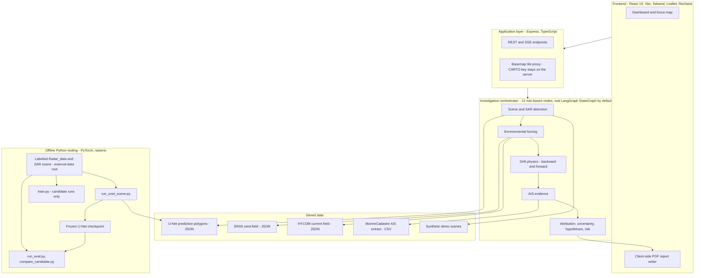

# 🇮🇳 VIKSIT-NETRA

**AI-Powered Maritime Environmental Intelligence & Oil-Spill Attribution System**

> **"See the Spill. Trace the Source. Predict the Drift."**

**Built by Viksit Tech**


-EE4C2C?logo=pytorch&logoColor=white)


VIKSIT-NETRA is an investigation workbench for suspected marine oil spills. Starting from a Sentinel-1 SAR scene, it
segments the suspected slick with a U-Net, reconstructs where the oil probably came from with a physics-based Lagrangian
drift model driven by wind and ocean-current fields, ranks vessels whose AIS tracks are compatible with that history, and
packages the evidence, uncertainty and limitations into an explainable dashboard and a colour-coded PDF report.

It is a **decision-support research prototype**. It produces *investigative leads*, not findings of responsibility.

> **Naming note.** The project name is **VIKSIT-NETRA**. The repository folder, the in-app header, the environment
> variables (`AEGIS_*`) and internal schema identifiers (`aegis.*`) still carry the earlier working name *AEGIS Sentinel*.
> They are historical identifiers, not a separate product.

**Contents:** [At a glance](#at-a-glance) · [Problem](#the-problem) · [Solution](#our-solution) · [Architecture](#system-architecture) ·
[Pipeline](#end-to-end-pipeline) · [AI/ML](#aiml) · [Agentic layer](#agentic--intelligence-layer) · [Drift](#drift-model) ·
[Attribution](#vessel-attribution) · [Data](#data-sources) · [UI](#ui--dashboard) · [Evaluation](#model-evaluation) ·
[Limitations](#limitations) · [Roadmap](#future-roadmap) · [Setup](#setup) · [Testing](#testing) · [Deployment](#deployment)

---

## At a glance

| Capability | Technology / method (verified in the repository) |
|---|---|
| Satellite detection | U-Net (PyTorch) on Sentinel-1 VV backscatter GeoTIFFs; tiled inference, probability raster, thresholded mask, geospatial polygons. Run **offline**; the web server reads the stored polygons |
| Environmental forcing | ERA5 10 m wind (`u10`, `v10`, 2 hourly fields for the demonstrated event) and a hourly HYCOM surface-current analysis (one event), interpolated in space and time with explicit per-sample provenance |
| Drift modelling | Lagrangian particle ensemble (TypeScript), RK2 midpoint, wind leeway + rotation, random-walk diffusion; backward (origin) and forward (scenario) modes |
| AIS analysis | NOAA/USCG MarineCadastre AIS CSV parsing, UTC handling, sentinel-value removal, track reconstruction, gap-aware interpolation, per-track quality grading |
| Vessel attribution | Transparent four-factor heuristic score (proximity, timing, corridor consistency, course alignment) with adjustable weights. **Investigative leads only** |
| Agentic investigation | 12 rule-based nodes run inside a real `@langchain/langgraph` StateGraph (labelled `DETERMINISTIC_FALLBACK` if it cannot load). **No LLM is used** |
| Explainability | Exact Shapley contributions of the linear score, leave-one-factor-out rank sensitivity, competing hypotheses H1-H4, exclude-vessel counterfactual, forcing-sensitivity analysis |
| Visualisation | React 19 + Leaflet dashboard, Recharts analytics, collapsible panels, full-screen focus-map mode |
| Reporting | Colour-coded, provenance-labelled PDF generated in the browser by a custom writer (`src/report/pdfWriter.ts`) |

---

## The problem

Marine oil spills are hard to attribute quickly:

- **Detection is only the first step.** SAR imagery can show dark, low-backscatter surface anomalies, but such areas are
  also produced by look-alikes (low wind, biogenic films, rain cells), so a segmentation mask is not proof of oil.
- **Origin is not where the slick is.** By the time a satellite passes, wind and currents have moved the oil, so the
  release location must be inferred by running the transport backwards.
- **Vessel activity is a separate, noisy record.** AIS positions are sparse, irregular, sometimes missing, and cover
  only what receivers heard.
- **Investigators need evidence, not just a mask:** what was observed, what was modelled, how much of the forcing was real,
  what is uncertain, and what is missing.

## Our solution

VIKSIT-NETRA links those steps into one traceable investigation, where every value carries a provenance label.

```text
Sentinel-1 SAR scene
        |
        v
U-Net segmentation  ----->  slick polygons (MODEL_PREDICTION)
        |
        v
Wind + ocean-current forcing (provenance per sample: REAL / PERSISTED / EDGE_CLAMPED / ...)
        |
        v
Lagrangian backtracking  ----->  probable origin zone (P90 particle hull, a region - not a point)
        |                          + forward drift scenarios
        v
AIS track analysis  ----->  candidate vessels (heuristic score, explained)
        |
        v
Hypotheses, counterfactuals, uncertainty, coverage warnings
        |
        v
Interactive dashboard + PDF investigation report
```

## Why VIKSIT-NETRA is different

- **One chain, not three tools.** Detection, forcing, backward and forward drift, AIS matching, explanation and reporting
  run in a single orchestrated investigation, and re-running from the scoring step after a weight change keeps upstream state.
- **Physics, not pattern matching, links the slick to vessels.** A vessel is scored against the *backtracked* origin
  corridor in space and time, not just its distance to the slick.
- **Honest forcing.** Every wind and current sample is labelled (`REAL`, `PERSISTED`, `EDGE_CLAMPED`, `LAND_OR_NO_DATA`,
  `NOT_AVAILABLE`). Forecast horizons are flagged when real forcing does not support them.
- **Ground truth is never presented as prediction.** The labelled reference mask is evaluation-only and is a separate,
  optional map overlay.
- **Explainable ranking.** Score, exact contributions, rank stability, competing hypotheses and counterfactuals are all
  exposed; a top score is drawn as a lead, never as a conclusion.

---

## System architecture



Important: **the web server does not run the U-Net.** Inference is done offline by `ml/inference/run_unet_scene.py`, which
writes polygons the server reads. Nothing in the application is real-time; it analyses stored data.

Not connected: Copernicus Marine (CMEMS), live Sentinel-1 download, live AIS feeds, satellite AIS.

---

## End-to-end pipeline

### Stage 1 - SAR preprocessing

**Input** a georeferenced single-band float32 VV backscatter GeoTIFF (the labelled dataset's scenes: EPSG:32616, 10 m pixels).
**Processing** z-score over the finite pixels of the whole scene, NaN to 0, 256 px tiles with 32 px overlap and reflect padding.
**Output** normalised tiles for the network. *The application does not download or radiometrically calibrate Sentinel-1
GRD products; the calibration and Process-API scripts under `ml/real_inference/` and `ml/inference/real_event_inference.py`
are experimental offline tooling and are not part of the verified pipeline.*

### Stage 2 - Oil-spill detection

**Input** normalised tiles. **Processing** U-Net forward pass, sigmoid, overlap-averaged probability raster, threshold 0.5,
8-connected components, specks below 500 px dropped, Douglas-Peucker simplification (15 m), transform to EPSG:4326.
**Output** slick polygons with area, axis and provenance `MODEL_PREDICTION`, plus a *measured* Dice/IoU/precision/recall
against the reference label of that scene (evaluation only).

### Stage 3 - Environmental forcing

**Input** wind and current fields (`aegis.env_field.v1` JSON, `[time][lat][lon]`, u east / v north, m/s).
**Processing** bilinear interpolation in space and linear in time; every sample gets a status: `REAL`, `PERSISTED` (time outside
the product), `EDGE_CLAMPED` (position outside the grid), `LAND_OR_NO_DATA`, `NOT_AVAILABLE`, `DEMO_CONSTANT`. Land cells are
`null` and never filled. A low-wind flag (< 3 m/s at observation time) raises the look-alike hypothesis.
**Output** forcing plus coverage fractions over the backtrack and forecast windows.

### Stage 4 - Lagrangian backtracking

**Input** slick polygons, forcing. **Processing** particles seeded uniformly over the slick and advected backwards in time
(see [Drift model](#drift-model)). **Output** particle tracks, ensemble-centroid path, snapshots.

### Stage 5 - Forward drift prediction

**Input** the same slick and forcing. **Processing** forward advection to T+6, 12, 24 and 48 h. Each horizon records how much of
its wind and current samples were `REAL`; a horizon is marked **supported** only when both are at least 50 % real.
**Output** impact-zone hulls per horizon, labelled *persistence scenario* when unsupported.

### Stage 6 - Origin-zone estimation

**Input** backtracked particle cloud. **Processing** centroid, P50/P90 radii, convex hull of the particles inside the P90 radius.
**Output** a *probable origin zone* (a region). The backtrack horizon is set by the analyst; no release time is estimated.

### Stage 7 - AIS trajectory matching

**Input** MarineCadastre AIS CSV. **Processing** UTC parsing, removal of AIS "not available" sentinels (SOG 102.3 kn, COG 360°,
heading 511), grouping by MMSI, duplicate-timestamp removal, linear interpolation that refuses to bridge gaps over 30 min,
per-track quality (window coverage, maximum gap, implied-speed outliers: GOOD / FAIR / POOR). **Output** vessel tracks.

### Stage 8 - Candidate ranking

**Input** tracks, slick polygons, backtracked corridor. **Processing** four-factor heuristic score (see
[Vessel attribution](#vessel-attribution)). **Output** ranked *candidate vessels* with priority level and evidence text.

### Stage 9 - Explainability

**Input** ranked candidates. **Processing** exact Shapley contributions, leave-one-factor-out ranks, competing hypotheses,
on-demand counterfactuals. **Output** contributions, rank stability, H1-H4 evidence balance, counterfactual tables.

### Stage 10 - Investigation report

**Input** the full investigation state plus the viewer's selections. **Processing** a browser-side PDF writer. **Output** a
colour-coded PDF (see [Investigation output](#investigation-output)).

---

## AI/ML

| Item | Detail |
|---|---|
| Architecture | `SAROilSpillUNet` (`ml/models/unet.py`): 4-level U-Net, channels 32-64-128-256-256, bilinear upsampling, BatchNorm + ReLU double convolutions, 1-channel input, 1 logit output; 4,322,241 parameters |
| Production checkpoint | `ml/checkpoints/unet_oil_spill_best.pth`, SHA-256 `33688d9b6148f792ec9900f881b6241468c0915080808bd3f5458259edde24af`, saved at epoch 3. **Frozen: never overwritten by training** (guarded in `ml/training/run_guard.py`) |
| Training data | Labelled Sentinel-1 oil-spill segmentation dataset (Zenodo 10.5281/zenodo.4672426; Gulf of Mexico, Sentinel-1A GRD VV, annotations derived from NOAA reports). The copy used here has **14 training + 7 held-out test scenes** (GeoTIFF, EPSG:32616, 10 m) and train/validation CSVs of 21,744 / 7,249 patches. Not stored in this repository |
| Training recipe | 256 px patches, loss 0.6 Dice + 0.4 BCE, AdamW (lr 1e-3, weight decay 1e-4), batch 4. It cannot be verified that the frozen checkpoint was produced by exactly this script version, because its training logs are not in the repository |
| Inference | Whole-scene z-score, 256 px tiles, 32 px overlap, threshold 0.5 (`ml/inference/run_unet_scene.py`) |
| Verification | `npm run verify:baseline`: 18 artifact hashes, checkpoint structure, and an independent NumPy re-implementation reproducing the stored PyTorch output (max abs diff 7.45e-08) |
| Experimental model | A 6-epoch candidate was trained and evaluated. **It is not the production model** and was not promoted (see [Model evaluation](#model-evaluation)) |

**What is and is not implemented.** Only the U-Net baseline is a trained model. The ensemble (U-Net++/DeepLabV3+/SegFormer),
self-supervised SAR encoder, look-alike classifier, learned drift correction, AIS sequence model, vessel GNN, probabilistic
attribution and multi-satellite validation are **extension points or blocked by missing data**; they produce no output
(`ml/extensions/capabilities.json`, `ml/extensions/interfaces.py`).

---

## Agentic / intelligence layer

**What "agentic" means here.** The investigation is a graph of 12 named, rule-based computation nodes that consume and produce
structured evidence, each recording its data sources, warnings and a confidence basis. There is **no language model** anywhere
in the runtime: nothing in an investigation is AI-generated text, and no measurement, track or metric is invented.
(`@google/genai` appears in `package.json` as an unused dependency inherited from the project template; no code imports it.)

| # | Node | Role |
|---|---|---|
| 1 | Scene & SAR Detection | Loads the scene and its slick record with provenance |
| 2 | Spill Geometry | Area, perimeter, axis, elongation |
| 3 | Environmental Forcing | Samples wind/current, checks coverage, flags look-alike risk |
| 4 | Backtracking | Backward ensemble, origin zone |
| 5 | Forward Drift Forecast | Forward ensemble, per-horizon forcing support |
| 6 | AIS Candidate Retrieval | Tracks and coverage |
| 7 | Vessel Attribution & Evidence | Four-factor scoring and evidence graph |
| 8 | Uncertainty & Quality Control | Uncertainty separated from confidence per component |
| 9 | Competing Hypotheses | H1 vessel compatible, H2 natural look-alike, H3 another vessel, H4 data insufficient |
| 10 | Risk Assessment | Extent-based, rule-based |
| 11 | Response Recommendation | Rule-based verification actions |
| 12 | Final Evidence & Report | Assembles the report state |

**Orchestration.** The default (`AEGIS_ORCHESTRATOR=auto`) executes these nodes inside a real `@langchain/langgraph` StateGraph
(`@langchain/langgraph` 1.4.16 verified). The investigation view reports `orchestrator_status: "LANGGRAPH"` and how many nodes the
LangGraph runtime invoked. If the package cannot be loaded, the same nodes run in a deterministic orchestrator and the run is
labelled `DETERMINISTIC_FALLBACK`; `AEGIS_ORCHESTRATOR=deterministic` forces it. Both give identical results (tested). Conditional
routing skips nodes whose inputs are missing (for example no AIS) and still produces a report. Progress streams to the UI over SSE.

**Also implemented:** provenance on every node event; on-demand counterfactuals (not an automatic graph node); investigator
feedback records, stored **in memory only** and marked `UNVERIFIED_INVESTIGATOR_INPUT`, never changing a score; a rule-based
review-priority score. This is not an active-learning or retraining loop.

---

## Drift model

Implemented in `server/lib/drift.ts` (a Python twin with constant forcing only, `drift/models/lagrangian.py`, is cross-checked by tests):

```text
dx/dt = U_current(x, t)  +  U_prior  +  alpha * R(theta) * U_wind10(x, t)  +  random-walk diffusion
```

| Term | Implementation |
|---|---|
| `U_current` | HYCOM surface current, bilinear in space and linear in time (zero, flagged, where no product exists) |
| `alpha` | wind leeway factor, default 0.03 (adjustable) |
| `R(theta)` | rotation of the wind vector by 5° to the **right** in the northern hemisphere, left in the southern |
| diffusion | isotropic random walk, per-axis std sqrt(2 K dt), K = 2.5 m²/s by default |
| `U_prior` | per-particle zero-mean N(0, 0.1 m/s) constant, used **only** when no current product exists; it is an uncertainty prior, not data |
| Integration | 2nd-order Runge-Kutta (midpoint), default step 30 min, 300 particles, 12 h backtrack, seed 42; backward mode reverses time |

- **Uncertainty:** the ensemble spread gives P50/P90 radii and hulls; forcing-status fractions state how much of the forcing was real.
- **Impact zones:** P90 hulls per horizon (6/12/24/48 h). They are transport envelopes of surface particles, **not** oil-thickness footprints.
- **Not modelled:** weathering (evaporation, emulsification, dispersion), beaching, Stokes drift, vertical processes, coastline interaction.
- **Not validated:** the drift has not been compared with observed slick or drifter trajectories, so no forecast accuracy is claimed. The
  forward runs are hindcast-type scenarios from reanalysis-type forcing, not operational forecasts.
- **What it can infer:** a region compatible with the modelled transport. **What it cannot:** a point of release, a release time, or a cause.

---

## Vessel attribution

For each vessel track the engine computes four factors in [0, 1] (`server/lib/attribution.ts`):

| Factor | Meaning |
|---|---|
| Spatial | closest approach of the AIS track to the *observed* slick polygon (1 at 0 km, linear decay to 0 at 25 km) |
| Temporal | timing of that approach relative to the window [T0 - H, T0 + 0.5 h] (1 inside, linear decay to 0 over 3 h outside) |
| Trajectory | space-time consistency with the *backtracked* origin corridor: distance to the corridor centroid minus its P90 radius, sampled every 10 min; 1 inside the envelope, exp(-excess / 3 km) outside |
| Kinematic ("consistency" weight) | axial alignment of course over ground with the slick's principal axis at closest approach; neutral 0.5 if near-stationary or course missing |

Composite score = weighted sum (default weights 0.35 / 0.25 / 0.25 / 0.15, adjustable in the UI and normalised). Levels:
`>= 0.75` HIGH PRIORITY CANDIDATE, `>= 0.5` MEDIUM, otherwise LOW. Wind-versus-slick-axis agreement is reported as scene evidence, not as a per-vessel factor.
The 2018 offline analysis (`ml/inference/attribution.py`) is reproduced by a regression test and kept only for comparison.

Every candidate carries `causality_status: "NOT CONFIRMED"`, evidence *for* and *against*, AIS quality, rank stability and a scientific disclaimer.

> **VIKSIT-NETRA identifies investigative leads and does not establish legal causation or guilt.** The score is a heuristic
> compatibility measure with no calibration against confirmed polluters; it is not a probability.

---

## Data sources

| Data | Source | Purpose | Kind |
|---|---|---|---|
| Sentinel-1 SAR scene `2018_09_26.tif` | Labelled dataset (Zenodo 10.5281/zenodo.4672426); identical to the held-out test image | Real-scene inference | **Real**, in the *external* data root (not in this repo) |
| Reference masks | Same dataset; annotations derived from NOAA reports | Evaluation and training labels | **Labelled ground truth** (external); never a prediction |
| Labelled `Radar_data` | Same dataset (14 train + 7 test scenes) | Training and held-out evaluation | **Labelled** (external) |
| ERA5 10 m wind | ECMWF ERA5 hourly single levels via the Copernicus CDS | Wind forcing | **Real**, but only 2 hourly fields (14:00, 15:00 UTC) for 2018-09-26; `data/era5/` |
| Ocean current | HYCOM + NCODA GOMl0.04 expt_32.5, hourly surface analysis | Current forcing | **Real historical *model analysis*** (not observations, not Copernicus Marine); `data/currents/`; **one event only** |
| AIS | NOAA/USCG Nationwide AIS via MarineCadastre (terrestrial receivers), 2018-09-26 | Vessel tracks | **Real**, 13,104 reports, 87 MMSI, clipped to the SAR footprint; `data/ais/2018/` |
| Model outputs | `ml/results/inference/2018_09_26/*.json`, `data/sentinel1/derived/*` | Slick polygons; report images | **Model output** (derived overlays are not georeferenced) |
| Demo scenes | `data/sample/` (generated by `scripts/generate_sample_data.py`) | Interface demonstration | **Synthetic.** Scene IDs imitate Sentinel-1 product names but nothing about them is real; vessel names are fictitious and tagged `[SYNTHETIC]` |
| Other Sentinel-1 files | `data/sentinel1/copernicus_sigma0_test.tif` and `copernicus_oil_probability.tif` (tracked, an unrelated 1024 x 1024 tile offshore California); local `S1A_20250704_*` experiment outputs (not tracked) | Earlier experiments | Not used by the app. The local 2025 sigma0 output was entirely nodata in the windows sampled, so its all-zero "oil mask" says nothing about oil |

Sources referenced by code but **not** implemented as live integrations: Copernicus Data Space, Copernicus Marine, CDS. The server
analyses stored data only (`/api/config/credentials-status` reports `live_ingestion_implemented: false`).

---

## UI / dashboard

Screenshots are not yet in the repository (there is no `docs/` folder). Suggested paths for when they are added:

| Screen | Planned path |
|---|---|
| Investigation dashboard | `docs/images/dashboard.png` *(not yet added)* |
| Focus map | `docs/images/focus-map.png` *(not yet added)* |
| PDF report | `docs/images/report.png` *(not yet added)* |

What the current UI provides:

- **Map (Leaflet):** SAR frame, slick polygons (`MODEL_PREDICTION`), optional reference-label overlay (off by default, evaluation only), backtracked particle paths,
  origin zone, forward impact zones per horizon (dashed when unsupported), wind vectors, current vectors, AIS tracks of ranked candidates, legend, layer toggles,
  fit-to-spill / origin / forecast / all-evidence, forecast timeline (step and play), normal zoom.
- **Focus map:** enlarges the same map instance to full screen, keeping scene, layers, horizon and selection; panels collapse into drawers; `Esc` exits.
  Deep links: `/?focus=1`, `/?focus=1&drawer=candidates`.
- **Panels:** collapsible *Spill & Environment* (provenance, measured vs stored metrics, environment sources and coverage) and *Candidate Vessels*
  (score, contributions, evidence for/against, AIS quality, rank sensitivity, "how to read these numbers").
- **Dock tabs:** Investigation Agents (timeline, per-node evidence, orchestrator status), Analytics (Recharts), Hypotheses / Uncertainty / Risk, Counterfactuals.
- **Controls:** scene selector, workflow stepper, weights dialog, drift-settings dialog, U-Net diagnostics (model registry), self-test runner, report download.

The in-app *Docs* dialog describes provider credentials for live ingestion, which the server does not implement.

---

## Investigation output

| Output | Where |
|---|---|
| Probable origin zone (P90 hull, centroid, radius, horizon) | map, panel, report |
| Drift scenarios / forecast per horizon with forcing-support flags | map timeline, report |
| Candidate vessels with score, level, contributions, evidence for/against | candidate panel, report |
| Uncertainty by component, coverage of forcing, warnings, NOT ASSESSED list | dock, report |
| Competing hypotheses H1-H4 with evidence balance | dock, report |
| Counterfactuals and forcing sensitivity | dock, report |
| PDF incident report | REPORT button |

The report is generated in the browser (`src/report/`, custom PDF writer). It contains scene metadata, model-run provenance (checkpoint hash,
preprocessing, threshold), measured and stored segmentation metrics each labelled, environmental provenance, backtrack, forward scenarios,
origin zone, candidates, evidence, uncertainty, hypotheses, counterfactuals, orchestrator status, limitations, and an explicit non-legal-proof
disclaimer on every page. It embeds non-georeferenced overlay images from an earlier evaluation run (model output on a display-normalised
rendering that is not radiometrically faithful).

An investigator can use these outputs to decide where to look (origin zone), which vessels' records to request first (leads), what is missing
(coverage and NOT ASSESSED fields), and which assumptions matter (sensitivity). Verification still requires in-situ sampling, aerial
surveillance, vessel records and authoritative AIS.

---

## Explainability

| Element | What it is |
|---|---|
| **Heuristic score** | Weighted linear rule of four factors. Not a probability; not evidence of guilt |
| **Shapley contributions** | Exact Shapley values of that *linear* score relative to the mean vessel (additivity verified to 1e-9). They explain the score; they are not learned |
| **Evidence factors** | The four raw measurements, with plain-language reasons for and against |
| **Rank sensitivity** | Rank when each factor is removed in turn; `stable` if the rank moves by 2 or fewer |
| **Competing hypotheses** | Supporting vs contradicting evidence for H1-H4; a transparent heuristic balance, capped when contradicted, not a probability |
| **Exclude-vessel counterfactual** | Re-ranks without a chosen vessel. Labelled as an *analytical scenario*, not an observation |
| **Forcing sensitivity** | Re-runs the backward ensemble and re-scores under wind-factor 2 % / 4 % and current x0 / x0.5 / x1.5 cases (what-if variations, not data) |
| **Provenance** | Every node event lists its data sources; every forcing sample its status |

Distinction: a **heuristic contribution** explains a hand-built score; a **learned probability** does not exist in this system (no attribution model is trained);
**legal causation** is outside the scope of any output here.

---

## Model evaluation

All numbers below were **measured in this repository** (`ml/evaluation/run_eval.py`, decision by `ml/evaluation/compare_candidate.py`), on the 7 held-out
scenes, threshold 0.5. Files: `ml/results/eval_baseline.json`, `ml/results/eval_candidate_six_epoch.json`, `ml/results/comparison_candidate_vs_baseline.json`.
Run date 2026-09-19.

**Frozen baseline vs the 6-epoch candidate** (whole-scene z-score, 32 px overlap, full coverage: the registered evaluation protocol and the decision protocol):

| Metric | Baseline (production) | Candidate (not promoted) |
|---|---|---|
| Macro Dice | 0.4588 | 0.5520 |
| Macro IoU | 0.3393 | 0.4247 |
| Macro precision | 0.4401 | 0.5428 |
| Macro recall | 0.5953 | 0.7641 |
| Pooled Dice | 0.4731 | 0.4249 |
| Pixel false-positive rate (macro / pooled) | 0.0356 / 0.0415 | 0.0970 / 0.0615 |
| Calibration ECE / Brier | 0.0389 / 0.0390 | 0.0928 / 0.0905 |
| False-alarm scenes | 0 | 0 |

Per-scene Dice (baseline, candidate): 2018_09_26 (0.843, 0.908), 2018_12_19_d (0.002, 0.089), 2018_12_19_e (0.184, 0.472), 2018_12_19_f_ (0.324, 0.348),
20191015 (0.564, 0.555), 20200224_b (0.629, 0.731), 20200319b (0.666, 0.762). The spread between scenes is very large (0.002 to 0.91).

**Promotion decision: KEEP_BASELINE.** The pre-registered rule (`ml/experiments/six_epoch_protocol.json`) needs pooled *and* macro Dice to improve, no rise in
false-alarm scenes and no worse calibration. The candidate improved macro Dice and 6 of 7 scenes but failed pooled Dice, ECE and Brier: it detects more but
over-predicts and is worse calibrated. It was **not** promoted and is **not** claimed to be better. It differs from the baseline in more than epoch count
(scene normalisation, augmentation, early stopping) by design of the protocol. Its checkpoint is not tracked in git; its record is in `ml/model_registry.json`.

**Reproducibility of the stored numbers.** The historic protocol (`ml/inference/test_model.py`) re-run today reproduces the stored baseline metrics exactly (macro Dice 0.4650). Both are retained.

**Normalisation sensitivity.** Results depend strongly on preprocessing. On the real 2018-09-26 scene the baseline reaches Dice 0.843 with whole-scene normalisation but only
0.193 with the per-patch normalisation it was trained with. The app uses the whole-scene variant (`AEGIS_UNET_VARIANT=patch` switches). On that scene the measured
values against the reference label are Dice 0.8434, IoU 0.7292, precision 0.757, recall 0.952.

**Evaluation caveats (disclosed, not hidden)**

- **Validation leakage:** all 14 source scenes appear in both the training and validation CSVs, so validation Dice (stored 0.684; candidate 0.571) is optimistic and not independent.
- **Test independence:** no file is shared between train and test, but test-scene footprints overlap training-scene footprints in the same region on other dates
  (at least 12 days apart), and some labelled test-slick pixels coincide with training-labelled slick pixels (recurrent slick sites). The test set measures new
  acquisitions of a similar region, not new regions.
- **Small test set:** 7 scenes, per-scene Dice SD around 0.3; differences are descriptive and no significance is claimed.
- **Look-alikes:** no look-alike scenes are in the evaluation; no calibrated per-pixel confidence is reported.

---

## Limitations

1. **Forcing coverage.** Real ERA5 wind covers only about 3 % of the 12 h backtrack window and 1 % of the 48 h forecast window for the demonstrated event; the rest is held at the last field (`PERSISTED`). As a result **all four forecast horizons are flagged not supported by forcing** and are presented as persistence scenarios.
2. **Ocean current.** The current is a coarse (0.08° lattice) model analysis for **one event**, not observations. Other scenes have no current product and report `CURRENT_DATA_UNAVAILABLE / NOT_ASSESSED` (a zero-mean uncertainty prior is applied and flagged). Currents are not available for every historical scene.
3. **Single observation.** One SAR acquisition per scene: slick age and evolution are not observed; acquisition time (14:23:49 UTC) is a value recorded by an earlier analysis, not read from the raster.
4. **AIS.** Terrestrial receivers only, spatially clipped to the SAR footprint, vessels outside it are invisible, metadata is incomplete for some vessels, and AIS can be absent, spoofed or wrong.
5. **Weak separation.** For the demonstrated scene several vessels rate HIGH priority and the top two scores are essentially tied; the data do not single out a vessel.
6. **No learned attribution.** The attribution model is a hand-built heuristic without calibration data; there is no look-alike classifier (only a low-wind flag, which is on for the demonstrated scene).
7. **Domain shift.** The baseline was trained on a small Gulf of Mexico dataset (14 scenes); performance on other regions, sensors or processing chains is unknown.
8. **Physics.** No weathering, beaching, Stokes drift or waves; exposure of coasts, ports and sensitive areas is not assessed; drift is not validated against observations.
9. **Orchestration.** LangGraph is the active runtime but the nodes are rule-based; there is no LLM. Investigator feedback is in memory and non-persistent.
10. **Not real time and no authentication.** The app analyses stored data; there is no live ingestion, and the API has no authentication or authorisation layer.
11. **Repository hygiene.** Several packages in `package.json` are unused (`@google/genai`, `jspdf`, `react-leaflet`, `motion`, `dotenv`, `clsx`, `tailwind-merge`); the in-app header still says "AEGIS".

---

## Future roadmap

| Status | Item |
|---|---|
| **Implemented** | U-Net baseline segmentation and evaluation harness; Lagrangian backward/forward drift; HYCOM current loading with land masking; heuristic four-factor attribution; Shapley contributions; counterfactuals; forcing-sensitivity; H1-H4 hypotheses; real LangGraph orchestration with labelled fallback; PDF report; focus-map dashboard |
| **Experimental** | 6-epoch segmentation candidate (evaluated, not promoted); Sentinel-1 calibration and Process-API scripts (`ml/real_inference/`); the legacy FastAPI backend (`backend/`, optional, not used by the UI) |
| **Planned (extension points only, no model exists)** | U-Net++ / DeepLabV3+ / SegFormer ensemble; self-supervised SAR encoder; learned drift correction (with a validation gate already coded); Bayesian segmentation uncertainty; domain adaptation; multi-satellite validation; AIS sequence model; vessel-relationship GNN |
| **Blocked by data** | SAR look-alike classifier; calibrated probabilistic attribution; multimodal fusion; ocean-current forecasting models (these need labelled or confirmed-source data that does not exist in the repository) |

Status per capability is tracked in `ml/extensions/capabilities.json`.

---

## Project structure

```text
.
├── src/                    React frontend (App, components/, report/ PDF writer, lib/)
├── server.ts               Express entry point (API, SSE, tile proxy, static UI)
├── server/
│   ├── lib/                Engines: drift, environment, attribution, ais, scenes, investigation, counterfactual, review
│   └── tests/              Engine, report and agent tests (TypeScript)
├── ml/
│   ├── models/             U-Net definition
│   ├── checkpoints/        Frozen production checkpoint (+ candidates/, not tracked)
│   ├── inference/          Real-scene inference and legacy inference scripts
│   ├── evaluation/         Evaluation protocol, run_eval.py, compare_candidate.py
│   ├── training/           train.py and the production-checkpoint write guard
│   ├── datasets/           Dataset loader (labelled data is external)
│   ├── extensions/         capabilities.json and extension-point interfaces (not implemented)
│   ├── verification/       Independent NumPy re-implementation and baseline verification
│   ├── baseline/, experiments/, results/, model_registry.json, data_root.py
├── data/                   ais/2018 (AIS), era5/ (wind), currents/ (HYCOM), sample/ (synthetic demo), sentinel1/derived
├── drift/, ais/, attribution/, gis/   Python reference implementations (used by tests and the optional backend)
├── backend/                Optional legacy FastAPI service (not used by the UI)
├── scripts/                build-server.mjs, check-runtime-files.mjs, fetch_hycom_currents.py, generate_sample_data.py, package_release.py
├── tests/                  Python tests
├── Dockerfile, Dockerfile.api, docker-compose.yml, Procfile
├── DEPLOYMENT.md, FINAL_STATUS.md
└── .env.example
```

`FINAL_STATUS.md` is the detailed engineering status (results, limitations, run commands); `DEPLOYMENT.md` covers deployment and the real-data workflow.

---

## Setup

**Prerequisites**

- Node.js **22** (`.nvmrc`), npm.
- Python 3 for the offline ML tooling and Python tests. Verified with Python 3.9.6, `numpy` 2.0.2, `pandas` 2.3.3, `pillow` 11.3.0, `torch` 2.8.0, `rasterio` 1.4.3.
  `requirements.txt` also lists the optional legacy backend's packages (`fastapi`, `geopandas`, `pyproj`, ...), which were not installed for the runs documented here.

```bash
git clone <this-repository-url> && cd <repository-folder>
nvm use 22            # or any Node 22
npm ci

python3 -m pip install numpy pandas pillow rasterio torch     # minimal set for the ML tooling and Python core tests

cp .env.example .env  # then edit; .env is git-ignored, never commit it
```

**Environment variables (`.env`)**

| Variable | Purpose |
|---|---|
| `AEGIS_DATA_ROOT` | Folder holding the large external data (see below). Optional for running the UI |
| `APP_MODE` | `REAL` or `DEMO`; a UI label only, it does not filter data |
| `PORT`, `HOST` | Listen address (default 3000, 0.0.0.0) |
| `AEGIS_ORCHESTRATOR` | `auto` (default), `langgraph`, `deterministic` |
| `AEGIS_UNET_VARIANT` | `scene` (default) or `patch`: which stored normalisation variant of the prediction the server reads |
| `CARTO_API_KEY` or `VITE_CARTO_API_KEY` | Optional basemap key, read **only by the server**. Leave empty to use CARTO's public dark basemap. Never commit a real key |
| `AEGIS_MAX_CONCURRENT_JOBS`, `AEGIS_ALLOW_FRAMING` | Concurrency cap and iframe embedding switch |

**External data root.** The labelled dataset and the real SAR scene are not in the repository. Point `AEGIS_DATA_ROOT` at a folder containing
`ml/datasets/radar_data/Radar_data/` (train/test images and masks, train/val CSVs) and `Data/sentinel1/real/2018_09_26.tif`. The server and Python tools
resolve files there first (with `Data`/`data` case tolerance) and then in the repository. **The web app runs without it**: it reads the committed
prediction polygons, ERA5, current and AIS files. The root is needed to regenerate predictions, evaluate models or train.

## Running the application

```bash
# Development (hot reload) - http://localhost:3000
npm run dev

# Production
npm run build
npm start                      # node dist-server/server.cjs, http://localhost:3000
curl -s localhost:3000/api/health
```

Open `http://localhost:3000`. The 2018-09-26 scene analyses automatically on load; the three demo scenes are synthetic.

**Real-data workflow** (needs the external data root, `torch` and `rasterio`; all steps only *read* the frozen checkpoint):

```bash
python3 ml/evaluation/run_eval.py --label baseline            # held-out evaluation + leakage checks
python3 ml/inference/run_unet_scene.py --normalization scene  # frozen U-Net on the real scene -> polygons
python3 scripts/fetch_hycom_currents.py                       # 2018 HYCOM surface current subset (network, no credentials)
python3 ml/training/train.py --dry-run                        # candidate preflight; writes nothing
python3 ml/training/train.py --epochs 6 --run-name six_epoch_experiment --normalization scene --early-stopping-patience 2 --augment --seed 42
python3 ml/evaluation/run_eval.py --checkpoint ml/checkpoints/candidates/<run>/candidate_best.pth --label candidate_six_epoch
python3 ml/evaluation/compare_candidate.py --candidate ml/results/eval_candidate_six_epoch.json   # decision record; never promotes
```

The 6-epoch run took about 3.5 hours on macOS using the MPS device, while other jobs shared the machine (wall time is not a benchmark). The comparison script only writes a decision record; it never replaces a checkpoint.

## Testing

Results from a fresh run on 2026-09-19 (Node v22.23.2, macOS, Python 3.9.6):

| Command | Result |
|---|---|
| `npm run lint` (`tsc --noEmit`) | passed |
| `npm run test:ts` (all TypeScript tests) | **51 / 51 passed** |
| &nbsp;&nbsp;`npm run test:engine` | 27 / 27 (drift physics, conventions, environment, AIS, attribution, real ERA5 values) |
| &nbsp;&nbsp;`npm run test:report` | 10 / 10 (generated PDF structure, text, colour semantics, layout) |
| &nbsp;&nbsp;`npm run test:agents` | 14 / 14 (12 nodes, real LangGraph vs fallback equivalence, routing, counterfactuals, Shapley additivity, capability honesty) |
| `npm run test:python:core` | 65 run, OK, **1 skipped** (a "training without torch refuses" guard, skipped because torch is installed) |
| `npm run build` | passed (main bundle about 968 kB; size warning only) |
| `npm run verify:build` | 15 / 15 required runtime files present |
| `npm run verify:baseline` | passed: 18 artifact hashes, checkpoint structure, NumPy reproduction (max abs diff 7.45e-08) |
| `npm run test:python` (legacy FastAPI backend test) | **not runnable here**: needs `pyproj`, which is not installed. The backend is optional |

There is no automated browser (end-to-end UI) test suite; the UI was checked with screenshots only. The Docker image build was not executed in this environment.

## Deployment

| Option | What exists |
|---|---|
| Node / production server | `npm run build && npm start`; the Express server also serves the built UI |
| Docker | `Dockerfile`: multi-stage, Node 22, runs as the unprivileged `node` user, health check on `/api/health`, fails the build if a required runtime file is missing |
| docker-compose | `docker compose up --build` starts the web service on port 3000; `docker compose --profile api up --build` also starts the optional legacy FastAPI service (`Dockerfile.api`, port 8000) which the UI does not call |
| Procfile | `web: node dist-server/server.cjs` (select a **Node** buildpack; build with `npm ci && npm run build`) |

More detail in [`DEPLOYMENT.md`](DEPLOYMENT.md). This is a research prototype; it has no authentication layer and should not be exposed publicly as-is.

## Security and data

- Configuration and secrets are read from environment variables; `.env` is git-ignored and is not committed. Keep API keys out of the repository and out of the README.
- The CARTO key is used only by the server-side tile proxy (`/api/basemap/{z}/{x}/{y}.png`); the client does not read it. Note that `vite.config.ts` still defines compile-time replacements for that variable: current client code does not reference them (the key was verified absent from `dist/`), but referencing them from client code would embed the key in the public bundle.
- Basic hardening present: `X-Content-Type-Options`, `X-Frame-Options: DENY` by default, a concurrent-job cap (HTTP 429), input validation on scene ids and tile coordinates. There is no authentication.
- **Data terms.** ERA5 (Copernicus), HYCOM, NOAA/USCG AIS and the Zenodo labelled dataset each have their own licence and attribution requirements, which were not audited here.
  Review them before redistributing. The repository contains real 2018 AIS vessel names and MMSIs from public NOAA data; treat any per-vessel output as an unverified lead.

## Ethical and operational disclaimer

VIKSIT-NETRA provides investigative intelligence and candidate attribution. It does not establish legal responsibility, vessel guilt, or definitive causation. Human investigators and authoritative evidence remain necessary for operational or legal decisions.

## Team

**Viksit Tech** - the team that develops VIKSIT-NETRA.

## License

No license has been specified yet. Third-party data and libraries used by the project carry their own terms.
